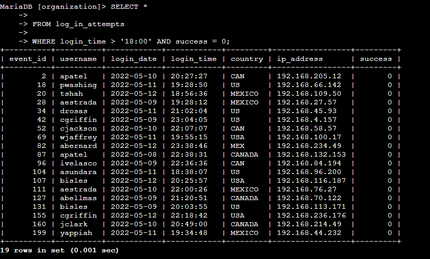
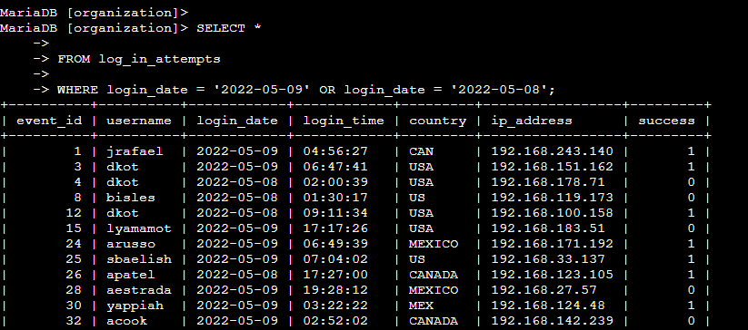
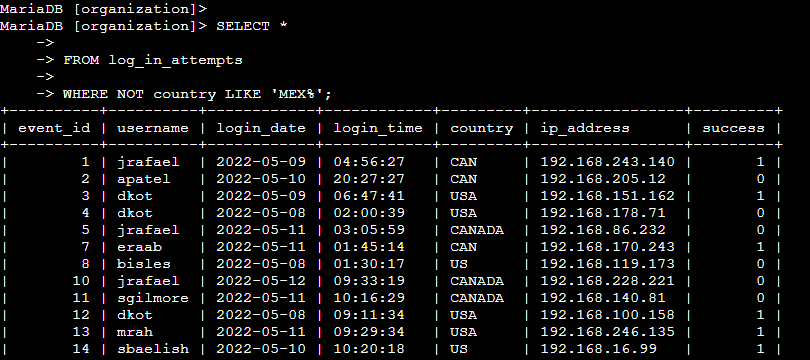
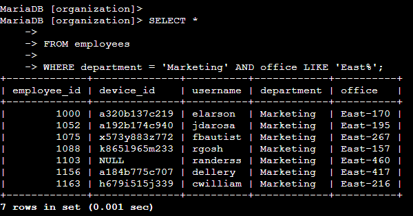
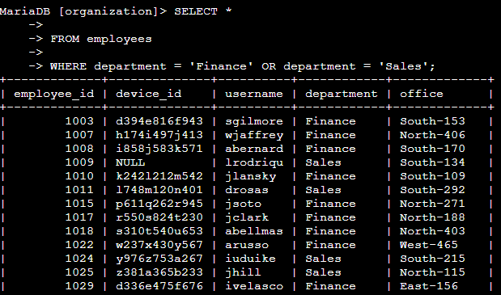
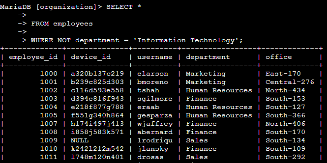

# Apply Filters to SQL Queries

## Project Description
My organization is working to make their systems more secure. My team was brought in to investigate potential security issues and to update computers using the data provided. I was responsible for filtering the required data from the database and forwarding the filtered results to my manager. I used SQL queries with filters to extract the necessary information.

## Retrieve After Hours Failed Login Attempts
To investigate failed login attempts that were made after business hours (18:00), I used the following query:

```sql
SELECT *
FROM log_in_attempts
WHERE login_time > '18:00' AND success = 0;
```


I selected all data from the `log_in_attempts` table and applied two conditions using the `WHERE` clause. The first condition filters for login attempts that occurred after 18:00. The second condition filters for failed login attempts, where a value of `0` represents an unsuccessful login.

## Retrieve Login Attempts on Specific Dates
To investigate login attempts on specific dates, I used the following query:

```sql
SELECT *
FROM log_in_attempts
WHERE login_date = '2022-05-09' OR login_date = '2022-05-08';
```


I selected all data from the `log_in_attempts` table and applied two conditions. The first condition filters login attempts on `2022-05-09`, and the second condition filters login attempts on `2022-05-08`. The `OR` operator allows results from either date to be returned.

## Retrieve Login Attempts Outside of Mexico
To investigate login attempts outside of Mexico, I used the following query:

```sql
SELECT *
FROM log_in_attempts
WHERE NOT country LIKE 'MEX%';
```


I selected all data from the `log_in_attempts` table and filtered the results using the `WHERE` clause. The `LIKE 'MEX%'` pattern matches values such as "MEXICO" or "MEX". The `NOT` operator ensures that only login attempts from countries outside of Mexico are returned.

## Retrieve Employees in Marketing
To retrieve employees in Marketing, I used the following query:

```sql
SELECT *
FROM employees
WHERE department = 'Marketing' AND office LIKE 'East%';
```



I selected all data from the `employees` table and applied two conditions. The first condition filters employees whose department is "Marketing". The second condition filters offices that begin with "East". The `AND` operator ensures both conditions must be met.

## Retrieve Employees in Finance or Sales
To retrieve employees in Finance or Sales, I used the following query:

```sql
SELECT *
FROM employees
WHERE department = 'Finance' OR department = 'Sales';
```


I selected all data from the `employees` table and applied two conditions. The first condition filters employees in the "Finance" department. The second condition filters employees in the "Sales" department. The `OR` operator returns employees belonging to either department.

## Retrieve All Employees Not in IT
To retrieve all employees not in IT, I used the following query:

```sql
SELECT *
FROM employees
WHERE NOT department = 'Information Technology';
```


I selected all data from the `employees` table and filtered the results using the `WHERE` clause. The `NOT` operator excludes employees whose department is "Information Technology".

## Summary
In this project, I used SQL queries with filtering techniques to extract relevant security and employee data from the database. The tasks focused on identifying potential security concerns and retrieving specific employee information by applying different conditions using the `WHERE` clause. I used operators such as `AND`, `OR`, and `NOT`, along with pattern matching using `LIKE`, to narrow down results based on time, date, location, department, and login status.

These queries allowed me to investigate failed login attempts after business hours, review login activity on specific dates, and identify login attempts from outside certain regions. I also filtered employee records based on department and office location to retrieve targeted information. Overall, this project demonstrated how SQL filtering can be used to efficiently analyze data, support security investigations, and retrieve relevant information for decision-making.