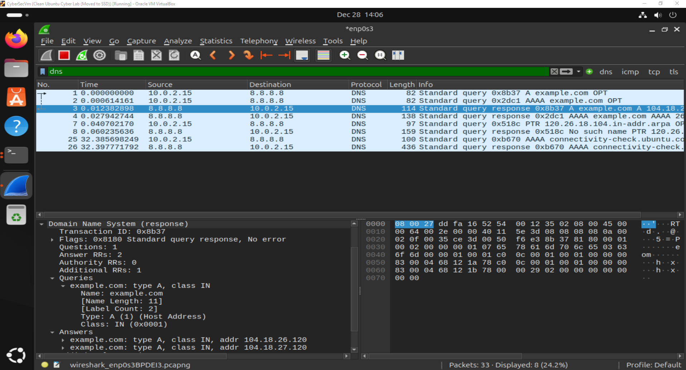
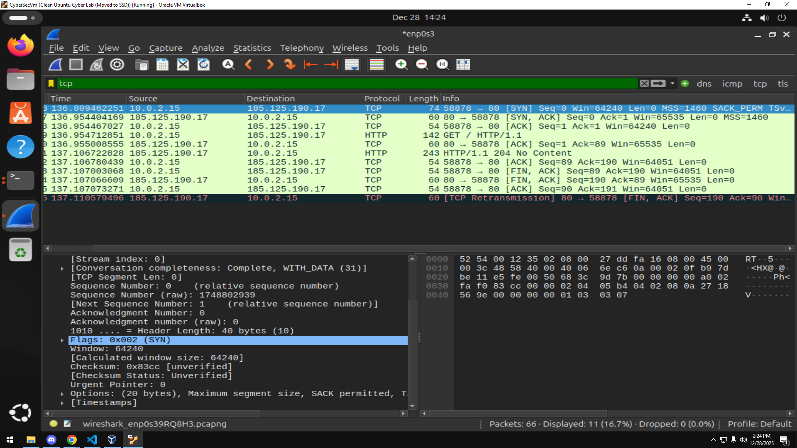
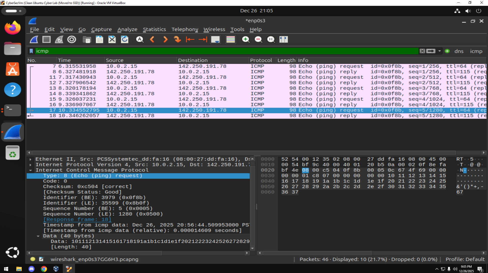
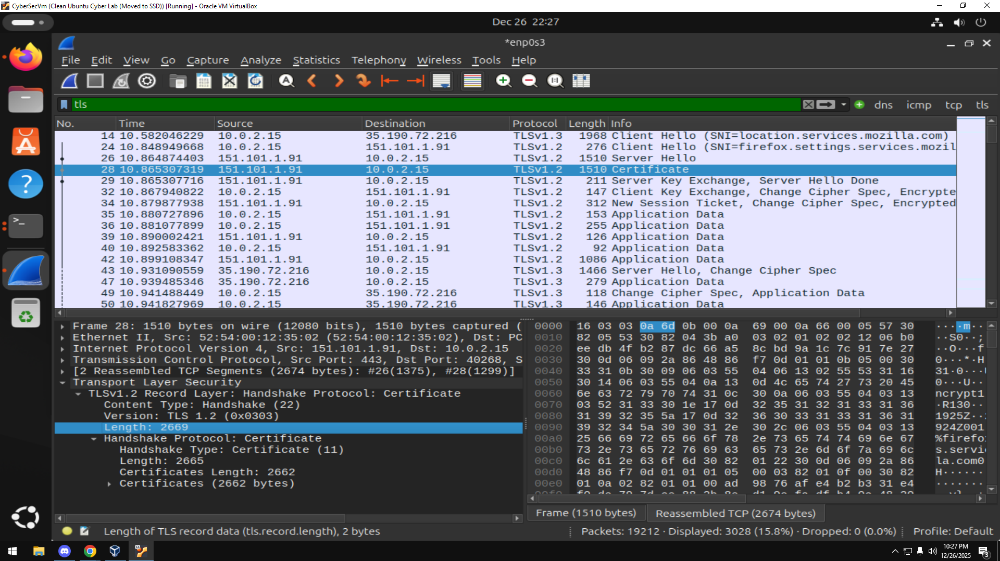

# Week 1 — Cybersecurity Foundations

## Overview
This week focused on understanding what cybersecurity is, why it exists,
and how systems communicate over a network. I explored how attackers
can passively gather information by observing network traffic.

## What I Did
- Completed TryHackMe Pre-Security rooms:
  - Introduction to Cyber Security
  - Careers in Cyber
- Captured live network traffic using Wireshark
- Identified DNS queries, ICMP traffic, and TCP 3-way handshakes

## Key Takeaways
- DNS resolution occurs before a TCP connection is established
- ICMP can be used to test reachability and measure latency
- Even when using HTTPS, metadata such as IP addresses, domain names (SNI),
  and timing remain visible
- Network traffic analysis enables powerful passive reconnaissance

## Evidence

## Open Question
What additional information could an attacker infer by correlating
multiple packet captures over time?