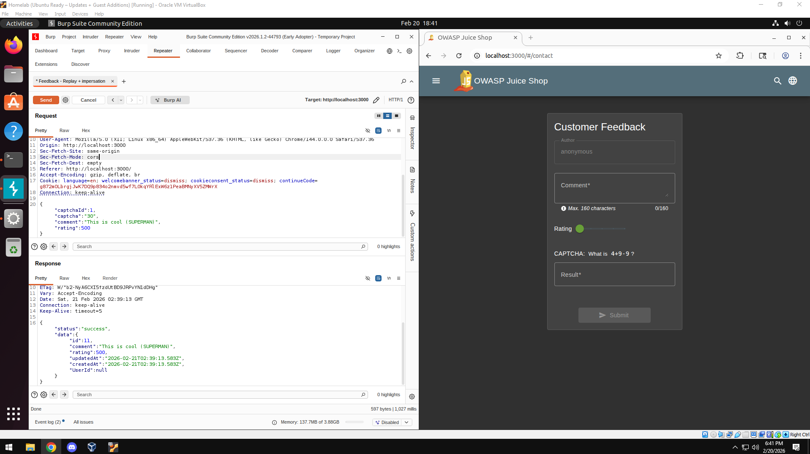
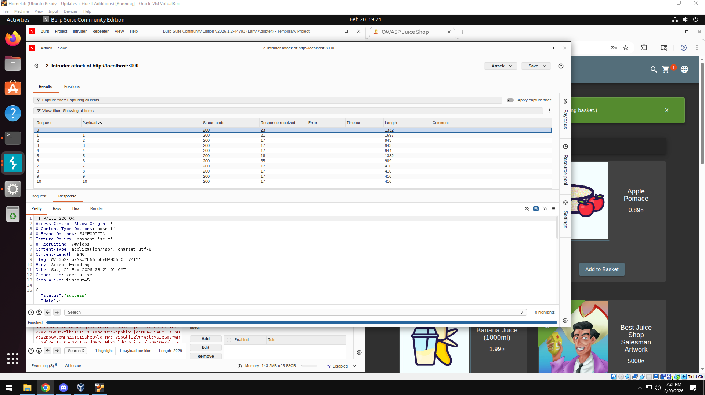
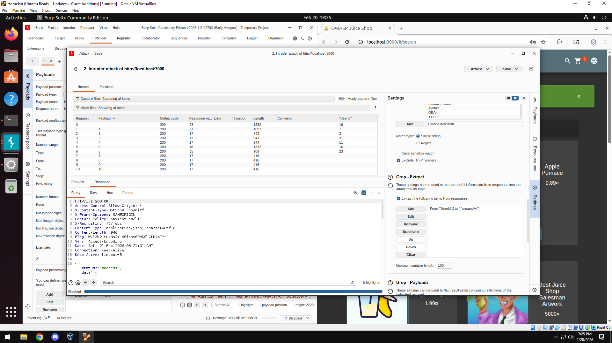
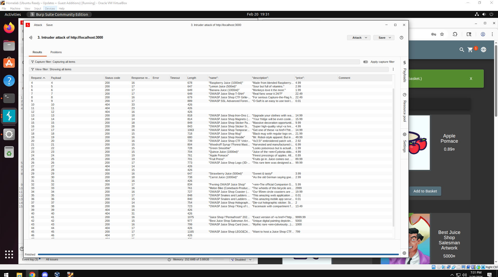
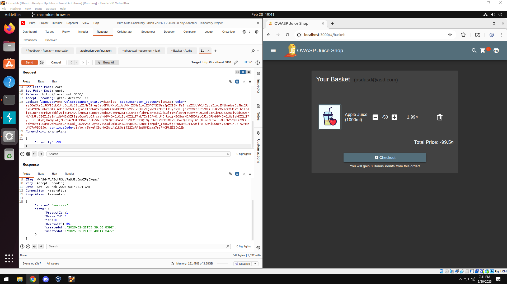
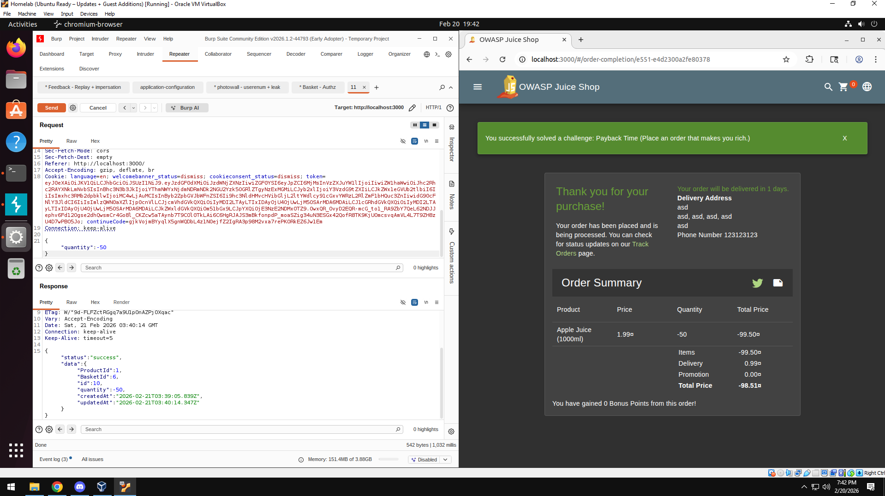
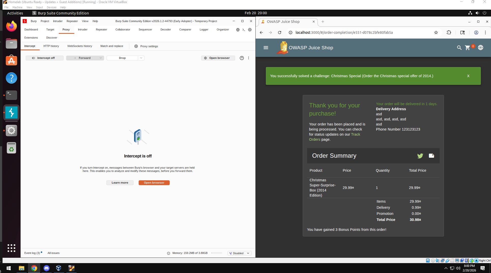

# Week 08 — Burp Suite

Target: OWASP Juice Shop (HomeLab)  
Tool: Burp Suite Community Edition  
Environment: Ubuntu 22.04 Homelab  

## Objective

The goal of this week was to use Burp Suite to analyze HTTP traffic, identify insecure behaviors, and practice Burp Suite on a real web application.

All testing was performed against a locally hosted OWASP Juice Shop instance in a controlled lab environment.

# 1. Reconnaissance — HTTP History Analysis

Using Burp’s HTTP History, I observed all requests between the browser and the application as I explored the web application.

### Key Findings

- Product reviews were accessible without authentication.
- Review objects included:
  - `message`
  - `author`
  - `productId`
- Feedback submission allowed anonymous input.
- CAPTCHA answer was exposed in a GET request before submission.

### Security Concern

The CAPTCHA logic was exposed client-side, allowing automation or replay attacks.

### Defensive Takeaway

CAPTCHA validation must occur server-side and should never expose answer logic through client-visible requests.

# 2. Feedback Replay & Impersonation

Using Burp Repeater:

- Modified feedback submissions
- Changed the rating field to an excessive value (`500`)
- Altered the author field

The application accepted modified requests without validation.

### Security Concern

Lack of server-side validation on rating values and identity integrity.

### Defensive Fix

- Enforce rating bounds server-side
- Prevent client-controlled identity fields
- Require authentication before accepting reviews

# 3. Sensitive Data Exposure — `/rest/memories`

The endpoint `/rest/memories` exposed user objects including:

- `id`
- `username`
- `email`
- `password hash`
- `role`

### Security Concern

Even though the password was hashed, exposing it increases attack surface and risk.

### Defensive Fix

- Implement strict access control
- Return only minimal required fields
- Apply role-based filtering

# 4. Account Creation & JWT Analysis

### Endpoint

`/api/Users/`

### Observations

The account creation request included:

- `email`
- `password`
- `security question`
- `security answer`

The response returned:

- Full user object
- Role
- ID

After login via `/rest/user/login`:

- A JWT token was returned
- Decoding the token revealed:
  - `id`
  - `username`
  - `email`
  - `role`
  - `password hash`

### Security Concern

Overexposure of user data inside the JWT payload.

### Defensive Fix

JWT payloads should contain minimal claims (e.g., ID and role only).

# 5. Broken Access Control — Basket Enumeration

By modifying basket IDs in Repeater:

`/rest/basket/6 → /rest/basket/5`

I was able to view other users’ baskets.

### Security Concern

Insecure Direct Object Reference (IDOR).

### Defensive Fix

Validate that the authenticated user owns the requested basket ID before returning data.

# 6. Product Enumeration via Intruder

Using **Burp Intruder**:

- Enumerated product IDs
- Used Grep Extract to capture:
  - `name`
  - `description`
  - `price`

### Security Concern

Predictable object identifiers without proper authorization validation.

# 7. Business Logic Flaw — Negative Quantity Manipulation

### Steps Performed

1. Added item to basket
2. Intercepted quantity update request
3. Modified quantity to a negative value
4. Application calculated a negative total price

### Security Concern

Failure to validate numeric boundaries server-side resulted in:

- Negative totals
- Financial manipulation

### Defensive Fix

- Enforce minimum quantity ≥ 1
- Validate all financial calculations server-side
- Reject negative integers

# 8. Hidden Product Enumeration — Christmas Special

The “Christmas Special” product was not visible in the normal product listing.

Using Intruder:

- Identified hidden product IDs
- Added hidden product to cart
- Completed purchase flow

### Security Concern

Hidden functionality should not rely solely on front-end visibility.

### Defensive Fix

Authorization checks must be enforced on product retrieval and purchase endpoints.

# Summary of Vulnerability Categories Observed

| Category                  | Example                          |
|---------------------------|----------------------------------|
| Broken Access Control     | Basket enumeration (IDOR)        |
| Excessive Data Exposure   | `/rest/memories`                 |
| Insecure Design           | Negative quantity manipulation   |
| Improper Input Validation | Rating value manipulation        |
| Business Logic Flaws      | Financial calculation abuse      |

# Reflection

This lab demonstrated how:

- Client-side trust leads to exploitation
- Input validation must occur server-side
- Authorization must be enforced on every object reference
- Business logic flaws are often overlooked compared to injection attacks

Burp Suite provided visibility into:

- Request modification
- Token decoding
- Object enumeration
- Parameter manipulation

The key lesson was not exploitation itself, but understanding how small validation failures can compound into systemic vulnerabilities.